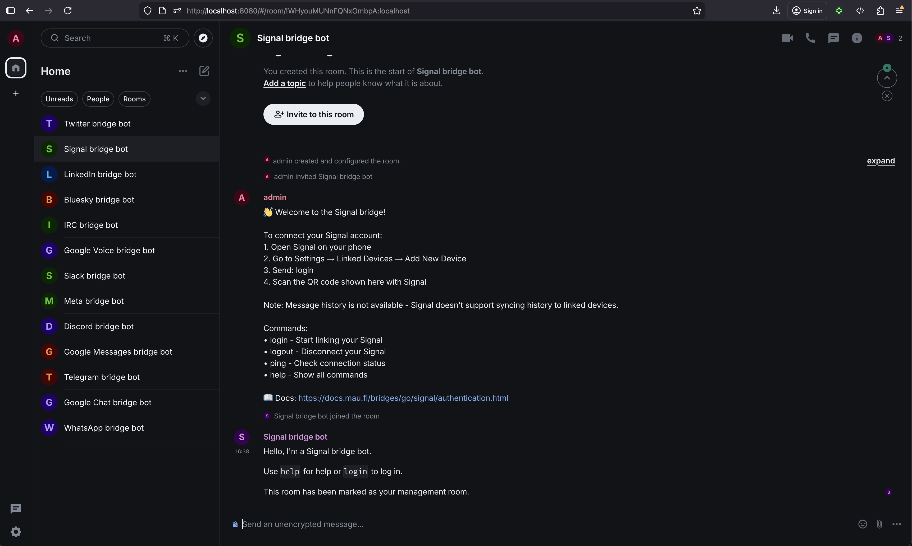
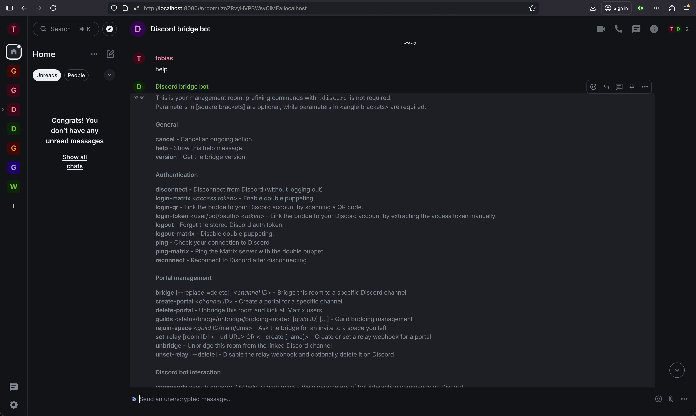

# muxbee

[](https://github.com/tobocop2/muxbee/actions/workflows/ci.yml)
[](https://codecov.io/gh/tobocop2/muxbee)

> **Early Development:** muxbee is experimental and bridge failures are expected. When bridges stop working, use `muxbee update` (or `u` in TUI) to pull latest images and restart.

A batteries-included Matrix chat bridge stack and orchestrator. Built with Go, a single binary that puts all your messages in one place — WhatsApp, Signal, Discord, Telegram, and more — without editing config files or managing secrets.


```bash
muxbee
```

Run one command. The TUI walks you through setup, starts services, and you're done. Toggle bridges, message the bot to link your account, and your chats appear.

> **Note:** The UI briefly blocks during startup and when toggling bridges while Docker operations complete. This is [expected behavior](https://github.com/tobocop2/muxbee/issues/3) for now.

## What It Does

muxbee is a single binary that sets up a self-hosted Matrix server with messaging bridges. All your chats from different platforms in one place. No config files to edit, no secrets to manage — just run it.

- **Synapse** (Matrix homeserver)
- **Element Web** (bundled chat interface — disable via TUI or `muxbee init --no-element`)
- **Messaging bridges** (WhatsApp, Signal, Discord, Telegram, etc.) — ships with most [mautrix](https://mau.fi/bridges/) bridges by default, but not limited to them. See [Adding a New Bridge](ARCHITECTURE.md#adding-a-new-bridge) for alternatives. PRs welcome!

Like [Bitlbee](https://www.bitlbee.org/), you interact with bridge bots to link accounts (e.g., message `@whatsappbot` and follow the prompts). Unlike Bitlbee, messages sync in real-time, you don't miss messages when offline, and modern features like reactions, threads, and encryption work.

### Linking Your Accounts

muxbee hosts Element Web out of the box. Run `muxbee open` or visit the URL shown after `muxbee up`. Prefer your own client? Disable Element via TUI settings or `muxbee init --no-element`.

Log in with the admin credentials shown during setup. If you missed them:

```bash
muxbee config show --show-secrets
```

Look for the `admin:` section in the output. On Linux/Mac, you can extract it directly:

```bash
muxbee config show --show-secrets | grep -A2 "^admin:"
```

After login, you'll see bridge bots ready to message. Each bot walks you through authentication.





### Architecture

See [ARCHITECTURE.md](ARCHITECTURE.md) for design decisions and configuration details.

## Background

Matrix is difficult to set up. Synapse alone has hundreds of configuration options. Add bridges and you're dealing with: appservice registration files with cryptographic tokens, database configuration for each bridge, Docker networking, rate limit tuning, and double-puppeting setup. Each bridge has its own config format. Getting it all working together is a real project.

[Bitlbee](https://www.bitlbee.org/) with libpurple was a great solution for years — an orchestrator for chat plugins, all accessible via IRC. muxbee is similar in spirit: an orchestrator for [mautrix](https://github.com/mautrix) bridges, all accessible via Matrix. Bitlbee's limitations: bridges poll (delayed messages), you miss messages when disconnected, no encryption, no reactions/threads/edits, and formatting gets mangled. Matrix handles all of this.

[Beeper](https://beeper.com) also solves this problem with a polished app and cloud-hosted bridges. muxbee is for tinkerers who want full control — no app installs, no cloud dependencies, runs on your hardware. There's some manual setup (messaging bridge bots), but it's simple for QR code bridges like WhatsApp, Discord, and Google Messages. You can also point Beeper or any Matrix client at the Synapse server muxbee sets up (untested).

## Supported Bridges

| Bridge | Login | Notes |
|--------|-------|-------|
| **WhatsApp** | QR code | Via linked device |
| **Signal** | QR code | No history sync (Signal limitation), needs testing |
| **Discord** | QR code or token | May violate ToS |
| **Telegram** | Phone + code | Requires API credentials from my.telegram.org |
| **Google Messages** | QR code | SMS/RCS |
| **Google Chat** | Cookies | Workspace accounts |
| **Google Voice** | Cookies | SMS/calls |
| **Slack** | Token + cookie | May violate ToS |
| **Bluesky** | Username/password | Needs testing |
| **Meta** | Cookies | Facebook/Instagram, needs testing |
| **Twitter** | Cookies | Needs testing |
| **LinkedIn** | Cookies | Needs testing |
| **IRC** | SASL | |

**Needs testing:** Signal, Bluesky, Meta, Twitter, and LinkedIn have only been verified for bot communication — full functionality needs testing. See [help wanted issues](https://github.com/tobocop2/muxbee/issues?q=is%3Aissue+is%3Aopen+label%3A%22help+wanted%22).

**Not supported:** iMessage (requires macOS or jailbroken iOS)

See [USAGE.md](USAGE.md) for login details and helper scripts for cookie extraction.

## Install

```bash
curl -fsSL https://raw.githubusercontent.com/tobocop2/muxbee/main/scripts/install.sh | sh
```

Downloads the correct binary for your platform to the current directory. Move it to your PATH.

If you have Go installed:

```bash
go install github.com/tobocop2/muxbee@latest
```

Installs the `muxbee` executable to `$GOPATH/bin` (or `$HOME/go/bin` by default).

Or build from source:
```bash
git clone https://github.com/tobocop2/muxbee.git
cd muxbee && go build -o muxbee .
```

See all releases: https://github.com/tobocop2/muxbee/releases

## Requirements

- **Docker 20.10+** with Compose V2 built-in (`docker compose`, not `docker-compose`)
- 2GB RAM (4GB recommended)
- 10GB disk space

Docker Desktop includes Compose V2. On Linux, install docker-compose-plugin or use Docker 23+.

## Usage

Run `muxbee` for the TUI, or `muxbee --help` for CLI commands.

See [USAGE.md](USAGE.md) for detailed documentation on bridges, connectivity modes, troubleshooting, and more.

## Helper Scripts

Some bridges require cookie/token extraction from your browser. See [`scripts/cookie-helpers/`](scripts/cookie-helpers/) for Node.js scripts that automate this. Alternative: [mautrix-manager](https://github.com/mautrix/manager).

## Issues

Found a bug or have a feature request? Check [existing issues](https://github.com/tobocop2/muxbee/issues) first, then [open a new one](https://github.com/tobocop2/muxbee/issues/new) if it doesn't exist.

Some bridges need testing — look for issues labeled [help wanted](https://github.com/tobocop2/muxbee/issues?q=is%3Aissue+is%3Aopen+label%3A%22help+wanted%22).

## Credits

muxbee wouldn't exist without the incredible [mautrix bridge ecosystem](https://github.com/mautrix) by [Tulir Asokan](https://github.com/tulir). Massive thanks for making high-quality Matrix bridges available to everyone.

## License

MIT
